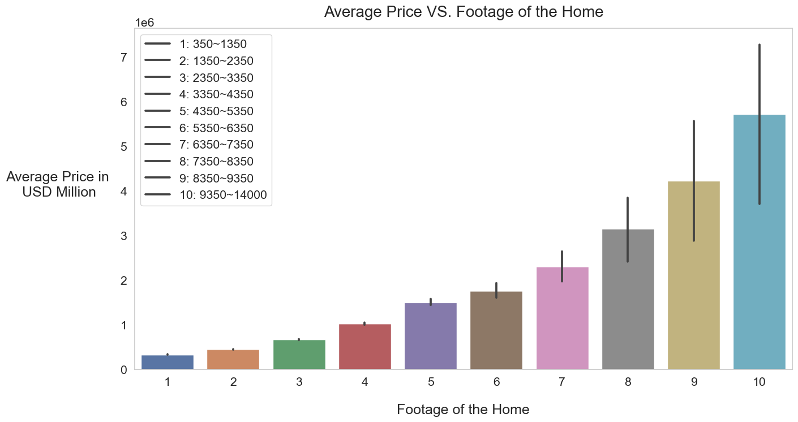
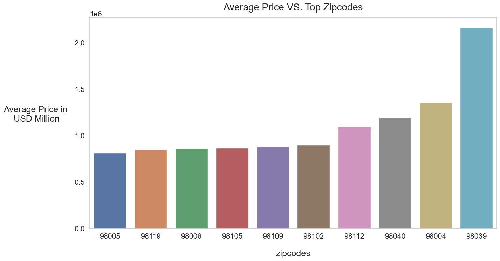
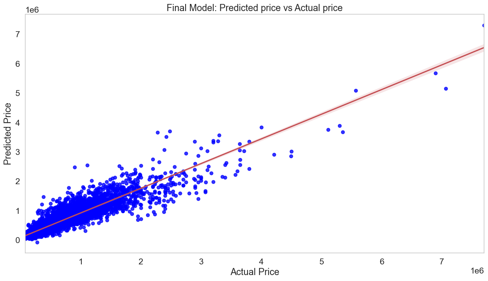
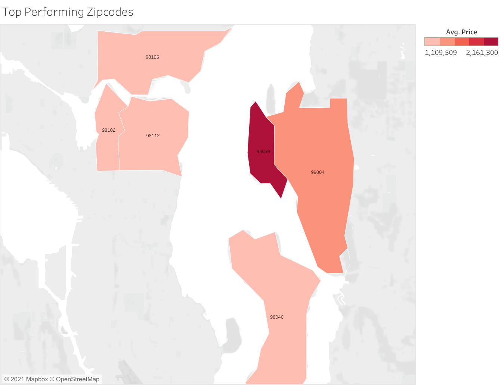

### King County - House Pricing Insights


## Overview

This project analyzes housing prices and features in King County for real estate agencies to see which feature has the strongest correlation with a house’s selling price. It will recommend which housing features to focus on when they are seeking to invest in King County Properties.


## Business Problem

Stakeholders: Real Estate Agencies

There has been an increase in competition among real estate agencies in King County due to the influx of professionals within the tech industry to the area. As this trend continues, it becomes more important for real estate agencies to strategically invest in properties with the right housing features to get the best selling price. 


### The Data

This project uses the King County House Sales dataset which contains the house sale records from 2014 to 2015. Each sale record contains the selling price and housing features at the point of sale. 

### Method


We first started by preparing data. We checked if there was any null value. We found some in the waterfront column and we replaced them with zeros. We also removed an outlier which had 33 bedrooms and 1.7 bathrooms. Finally, we checked if the data provided had a gaussian distribution.

We then explored the dataset to see which variables made the most sense for our baseline model. Two most correlated variables with our target ‘price’ were house square footage and the house grade level.




To begin, we chose just the footage of the house for our baseline model. Then, we built the second model by adding one additional feature, grade, to the baseline model. From there, we applied what we observed and learned from the first models to our final predictive model. We tried the following methods to build the models:   

- Standard scalar transformation
- Polynomial transformation 
- Dummy variable transformation

After iterating through different combinations of variables and regression models, we came to the conclusion that polynomial transformation and dummy variable transformation gave the best result. We then built the third model using the dummy variable of the zipcodes. 



The chart shows that even among the Top 10 zipcodes by average salary there is a great variance among the prices. Therefore, we decided to include zipcodes into our final analysis. 

Our final model included everything we mentioned above and dummy variable transformation of waterfront, bedrooms, and floors. 
Finally, to examine our final model, we ran it on the test data. 

 

### Results


According to the results we obtained from our final model, a house without any attributes won't be worth anything. However, it will increase the value by the highest amount if one considers the right zipcodes, a higher grade, a bigger footage of the house and having a waterfront feature.

Mean Squarred Error(MSE) means that for an average house price, this algorithm will be off by $151,476.5, given the average house price for this dataset is $540,296.6. Therefore, our model still has room for improvement.


Our model is not ideal since the distribution of the residuals is heteroscedastic. Therefore, the p value and confidence intervals of our variables are no longer reliable. The residuals also violated the normal distribution assumption for linear regression. Even though most of the target variables are mostly linearly related to independent variables, the high multicollinearity amongst the independent variables is still problematic.  

However, our model is more than 80% accurate in prediction, which is a huge improvement from our baseline model with only 50% accuracy. Also, the accuracy of our model is within the reasonable range, given that linear regression does not explain most relationships.




## Recommendations

According to our analysis, when looking to invest in houses in King County, we recommend to focus on: 

- House square footage
- House Grade
- Zip Code


 

Focusing on the highest coefficient neighborhoods, we recommend investing in the following zipcodes. 

1) Medina/Bellevue: Zipcodes 980039, 98004
2) Madison Park/ Capitol Hill: Zipcodes 98112, 98102
3) Mercer Island: Zipcode 98040

We also recommend staying away from certain areas.


The zipcodes in black areas above were zipcodes that performed poorly compared to others. There were areas the house prices were likely to be lower than other areas. They were focused around Auburn area and we recommend not purchasing properties in these areas.

1) Lake Morton: 98092
2) Federal Way: 98023
3) Lakeland North/South: 98003, 98001


### Future Analysis

For the future analysis, we would continue to explore correlations between different combinations of housing features to see if we could improve the correlation while maintaining our bias and variance levels. We would also investigate the effect size of zip codes and neighborhoods and see if there are specific properties in lower average selling price neighborhoods that are positive outliers within the zip code. Finally, We would want to incorporate a real estate agency’s costs into our models to improve the predictability. 	


### Repository Structure 

```bash

├── README.md
├── __init__.py
├── data      <-- CSV files used in analyses
├── Images      <-- Externally obtained and internally generated images
├── individuals     <--- Directory for individual workspaces
│   ├── harman
│   ├── jesus
│   ├── sejin
│   └── mia
├── King_County_Regression.ipynb     <-- Jupyter Notebook illustrating analysis 
└── King_County_Regression_slides.pdf   <-- Presentation slides

```
